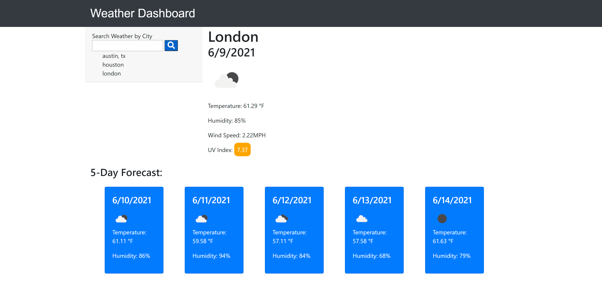

# Weather App
> This app checks the current and furture weather for major cities

## Table of contents
* [General info](#general-info)
* [Screenshots](#screenshots)
* [Technologies](#technologies)
* [Website](#website)
* [Features](#features)
* [Status](#status)
* [Inspiration](#inspiration)
* [Contact](#contact)

## General info
The user may choose a city and find the current and future weather at that locale.  The cities are saved for future reference

## Screenshots


## Technologies
* HTML5
* CSS3
* JavaScript 1.8
* Bootstrap v5.0
* OpenWeather

## Website
https://blueink38.github.io/weather-app/

## Code Examples
Show examples of usage:
```
$(document).ready(function(){
    var cities = [];
    $("#displayCity").hide();
    $("#extended5").hide();
```

## Features
* Check the current weather in a city
* See the future one week forcast
* Save cities for future reference

To-do list:
* Add weather to calendar
* Add alerts for inclement weather

## Status
This project is in progress.  As new needs arise and technology changes updates may arrive.

## Inspiration
This is inspired by ever changing weather for the modern traveler.

## Contact
Created by [blueink38@yahoo.com](https://github.com/blueink38) - feel free to contact me!